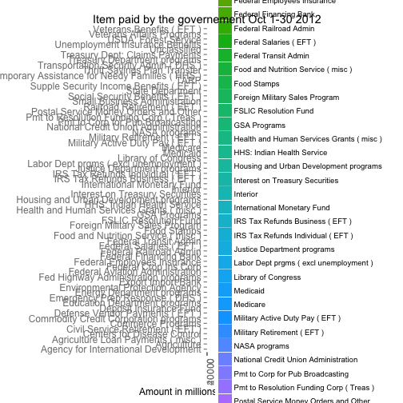
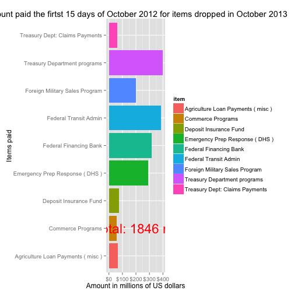

Exploring Governement government's finances 
========================================================

In order to understand the data i had at hand I started with the first table 
reading the documentaiton.
Table t1 explains "how much money does Uncle Sam have in his checking account on any given day""

I wanted to build a simple cumulative view of the the amount of money in each account at the beginnig fo the fiscal year for the time frame we had at our disposal.


```r
library(sqldf)
```

```
## Loading required package: DBI Loading required package: gsubfn Loading
## required package: proto Loading required namespace: tcltk Loading required
## package: chron Loading required package: RSQLite Loading required package:
## RSQLite.extfuns
```

```r
library(ggplot2)
library(colorspace)
library(scales)
setwd("/Users/carlotorniai/Dropbox/Zipfian/git/government-shutdown")
# Load all of the tables into R
.tables <- sqldf("SELECT tbl_name FROM sqlite_master", dbname = "treasury_data.db")$tbl_name
```

```
## Loading required package: tcltk
```

```r
for (.table in .tables) {
    if (!(.table %in% ls())) {
        .sql <- paste("SELECT * FROM", .table)
        assign(.table, sqldf(.sql, dbname = "treasury_data.db"))
    }
}
# Let's try to experiment with some queries..

print("Min date in T1")
```

```
## [1] "Min date in T1"
```

```r
print(sqldf("SELECT MIN(date) FROM t1;"))
```

```
##    MIN(date)
## 1 2005-06-09
```

```r
print("Max date in T1")
```

```
## [1] "Max date in T1"
```

```r
print(sqldf("SELECT MAX(date) FROM t1;"))
```

```
##    MAX(date)
## 1 2013-10-15
```

```r


brewerplot <- function(palette) {
    p + scale_fill_brewer(palette = palette) + opts(title = palette)
}
```


Let's see the trend of the amount of money in the Federal Reserve account from 2008

```r

# Let's get the data first
sql <- "select * from t1 where account =\"Federal Reserve Account\" and date > \"2008-01-01\""
federal_account_trend = sqldf(sql)
# Let's transform the dates in date
federal_account_trend$date <- as.Date(federal_account_trend$date)
# Let's plot and ad some axis
ggplot(federal_account_trend, aes(x = as.Date(date), y = open_today, color = account)) + 
    geom_line() + xlab("Year") + ylab("Amount in millions of US dollars") + 
    labs(title = "Money in the Federal Reserve Account") + scale_y_continuous(labels = dollar)
```

 


What I wantd to plot next was the amount of money per type of account at the beginning of each fiscal year from 2005 through 2013.


```r
accounts <- sqldf("select distinct account, open_fy, year from t1 where is_total==0 and account <>\"Total Opening Balance\"")
p1 <- ggplot(accounts, aes(x = year, y = open_fy, group = account, fill = account)) + 
    geom_bar(position = "dodge", stat = "identity") + xlab("Year") + ylab("Amount in millions of US dollars") + 
    labs(title = "Opening balance by account type between 2005 and 2013")

p2 <- p1 + scale_y_continuous(labels = dollar) + scale_x_continuous(breaks = 2005:2013)
# Here I want to try to use the scale on Y to display the dollar Now I want
# to add each entry
p2
```

 


We can notice during the 2008-2011 the start fo the Supplementing financing program
and the drop in the Tax and Loan Note accounts.

For more info see this:
(Supplementing financing program)[http://www.pyramis.com/fileadmin/templates/pyramis_public/downloads/us/unwinding_the_SFP_WP_Nov_2010.pdf]

I was also interested in seeing more closeley the trend of the Tax and Loan Note Account. This is an account in a "private-sector depository institution, held in the name of the district Federal Reserve Bank as fiscal agent of the United States, that serves as a repository for operating cash available to the U.S. Treasury. Withheld income taxes, employers’ contributions to the Social Security fund, and payments for U.S. government securities routinely go into a tax and loan account.""

("An account at a bank where a Federal Reserve bank deposits taxes that it receives from individual and corporate taxpayers. This increases the liquidity of the banks with the TT&L accounts; this in turn keeps the banking system stable.")[http://www.answers.com/topic/tax-and-loan-account#ixzz2i839QzWQ]


```r
sql <- "select * from t1 where account =\"Tax and Loan Note Accounts ( Table V )\" and date > \"2008-01-01\""
tax_account_trend = sqldf(sql)

# Let's plot and ad some axis
ggplot(tax_account_trend, aes(x = as.Date(date), y = open_today, color = account)) + 
    geom_line() + xlab("Year") + ylab("Amount in millions of US dollars") + 
    labs(title = "Money in the Tax and Loan Note Accounts") + scale_y_continuous(labels = dollar)
```

 


At this point I was curious to see how the money were spent during the financial crisis in particular looking for any significnat change in the expenses before and after 2008.


```r
expenses_2005 <- sqldf("select  year, account, item, sum(today) as total from t2 where is_total==0 and year=2005 and transaction_type==\"withdrawal\" and item not in (\"Public Debt Cash Redemp ( Table III B )\", \"Transfers to Federal Reserve Account Table V\", \"Transfers to Depositaries\") group by account, item order by fytd desc limit 10")

expenses_2006 <- sqldf("select  year, account, item, sum(today) as total from t2 where is_total==0 and year=2006 and transaction_type==\"withdrawal\" and item not in (\"Public Debt Cash Redemp ( Table III B )\", \"Transfers to Federal Reserve Account Table V\", \"Transfers to Depositaries\") group by account, item order by fytd desc limit 10")

expenses_2007 <- sqldf("select  year, account, item, sum(today) as total from t2 where is_total==0 and year=2007 and transaction_type==\"withdrawal\" and item not in (\"Public Debt Cash Redemp ( Table III B )\", \"Transfers to Federal Reserve Account Table V\", \"Transfers to Depositaries\") group by account, item order by fytd desc limit 10")

expenses_2008 <- sqldf("select year, account, item, sum(today) as total from t2 where is_total==0 and year=2008 and transaction_type==\"withdrawal\" and item not in (\"Public Debt Cash Redemp ( Table III B )\", \"Transfers to Federal Reserve Account Table V\", \"Transfers to Depositaries\") group by account, item order by fytd desc limit 10")

expenses_2009 <- sqldf("select year, account, item, sum(today) as total from t2 where is_total==0 and year=2009 and transaction_type==\"withdrawal\" and item not in (\"Public Debt Cash Redemp ( Table III B )\", \"Transfers to Federal Reserve Account Table V\", \"Transfers to Depositaries\") group by account, item order by fytd desc limit 10")

expenses_2010 <- sqldf("select year, account, item, sum(today) as total from t2 where is_total==0 and year=2010 and transaction_type==\"withdrawal\" and item not in (\"Public Debt Cash Redemp ( Table III B )\", \"Transfers to Federal Reserve Account Table V\", \"Transfers to Depositaries\") group by account, item order by fytd desc limit 10")

expenses_2011 <- sqldf("select year, account, item, sum(today) as total from t2 where is_total==0 and year=2011 and transaction_type==\"withdrawal\" and item not in (\"Public Debt Cash Redemp ( Table III B )\", \"Transfers to Federal Reserve Account Table V\", \"Transfers to Depositaries\") group by account, item order by fytd desc limit 10")
```


```r

# Now let's plot this in some meaningful graph let's start with 2008
expenses_2005 <- expenses_2005[complete.cases(expenses_2005), ]
# sort_expenses_2008 <- expenses_2008[order(expenses_2008$total, decreasing
# = TRUE) , ]
expenses_2005 <- transform(expenses_2005, item = reorder(item, total))
exp_2005 <- ggplot(expenses_2005, aes(x = item, y = total, fill = account)) + 
    geom_bar(stat = "identity") + xlab("Expense Type") + ylab("Amount in millions of US dollars") + 
    labs(title = "Top Category Expenses in 2005") + theme(axis.text.x = element_text(angle = 90, 
    hjust = 1, size = 12)) + theme(axis.text.y = element_text(hjust = 1, size = 12)) + 
    scale_y_continuous(labels = dollar) + coord_flip()
exp_2005
```

 

```r

# Now let's plot this in some meaningful graph let's start with 2008
expenses_2006 <- expenses_2006[complete.cases(expenses_2006), ]
# sort_expenses_2008 <- expenses_2008[order(expenses_2008$total, decreasing
# = TRUE) , ]
expenses_2006 <- transform(expenses_2006, item = reorder(item, total))
exp_2006 <- ggplot(expenses_2006, aes(x = item, y = total, fill = account)) + 
    geom_bar(stat = "identity") + xlab("Expense Type") + ylab("Amount in millions of US dollars") + 
    labs(title = "Top Category Expenses in 2006") + theme(axis.text.x = element_text(angle = 90, 
    hjust = 1, size = 12)) + theme(axis.text.y = element_text(hjust = 1, size = 12)) + 
    scale_y_continuous(labels = dollar) + coord_flip()
exp_2006
```

 

```r


# Now let's plot this in some meaningful graph let's start with 2008
expenses_2007 <- expenses_2007[complete.cases(expenses_2007), ]
# sort_expenses_2008 <- expenses_2008[order(expenses_2008$total, decreasing
# = TRUE) , ]
expenses_2007 <- transform(expenses_2007, item = reorder(item, total))
exp_2007 <- ggplot(expenses_2007, aes(x = item, y = total, fill = account)) + 
    geom_bar(stat = "identity") + xlab("Expense Type") + ylab("Amount in millions of US dollars") + 
    labs(title = "Top Category Expenses in 2007") + theme(axis.text.x = element_text(angle = 90, 
    hjust = 1, size = 12)) + theme(axis.text.y = element_text(hjust = 1, size = 12)) + 
    scale_y_continuous(labels = dollar) + coord_flip()
exp_2007
```

 

```r

# Now let's plot this in some meaningful graph let's start with 2008
expenses_2008 <- expenses_2008[complete.cases(expenses_2008), ]
# sort_expenses_2008 <- expenses_2008[order(expenses_2008$total, decreasing
# = TRUE) , ]
expenses_2008 <- transform(expenses_2008, item = reorder(item, total))
exp_2008 <- ggplot(expenses_2008, aes(x = item, y = total, fill = account)) + 
    geom_bar(stat = "identity") + xlab("Expense Type") + ylab("Amount in millions of US dollars") + 
    labs(title = "Top Category Expenses in 2008") + theme(axis.text.x = element_text(angle = 90, 
    hjust = 1, size = 12)) + theme(axis.text.y = element_text(hjust = 1, size = 12)) + 
    scale_y_continuous(labels = dollar) + coord_flip()
exp_2008
```

 

```r

# Now I just ant to have the legend be nicer but for now let's just don't
# worry about

# Now let's plot this in some meaningful graph let's start with 2009
expenses_2009 <- expenses_2009[complete.cases(expenses_2009), ]

expenses_2009 <- transform(expenses_2009, item = reorder(item, total))
exp_2009 <- ggplot(expenses_2009, aes(x = item, y = total, fill = account)) + 
    geom_bar(stat = "identity") + xlab("Expense Type") + ylab("Amount in millions of US dollars") + 
    labs(title = "Top category Expenses in 2009") + theme(axis.text.x = element_text(angle = 90, 
    hjust = 1, size = 12)) + theme(axis.text.y = element_text(hjust = 1, size = 12)) + 
    scale_y_continuous(labels = dollar) + coord_flip()
exp_2009
```

 

```r


expenses_2010 <- expenses_2010[complete.cases(expenses_2010), ]

expenses_2010 <- transform(expenses_2010, item = reorder(item, total))
exp_2010 <- ggplot(expenses_2010, aes(x = item, y = total, fill = account)) + 
    geom_bar(stat = "identity") + xlab("Expense Type") + ylab("Amount in millions of US dollars") + 
    labs(title = "Top Category Expenses in 2010") + theme(axis.text.x = element_text(angle = 90, 
    hjust = 1, size = 12)) + theme(axis.text.y = element_text(hjust = 1, size = 12)) + 
    scale_y_continuous(labels = dollar) + coord_flip()
exp_2010
```

 

```r

expenses_2011 <- expenses_2011[complete.cases(expenses_2011), ]

expenses_2011 <- transform(expenses_2011, item = reorder(item, total))
exp_2011 <- ggplot(expenses_2011, aes(x = item, y = total, fill = account)) + 
    geom_bar(stat = "identity") + xlab("Expense Type") + ylab("Amount in millions of US dollars") + 
    labs(title = "Expenses  in 2011") + theme(axis.text.x = element_text(angle = 90, 
    hjust = 1, size = 12)) + theme(axis.text.y = element_text(hjust = 1, size = 12)) + 
    scale_y_continuous(labels = dollar) + coord_flip()
exp_2011
```

 

```r

# Now I want to compare 2005 - 2008
expenses_05_06 <- rbind(expenses_2005, expenses_2006)
expenses_05_06_07 <- rbind(expenses_05_06, expenses_2007)
expenses_05_08 <- rbind(expenses_05_06_07, expenses_2008)
comulative_top_expenses_05_08 <- ggplot(expenses_05_08, aes(x = item, y = total, 
    fill = item)) + geom_bar(stat = "identity") + facet_wrap(~year) + scale_y_continuous(labels = dollar) + 
    coord_flip() + xlab("Expense Type") + ylab("Amount in millions of US dollars") + 
    labs(title = "Top Category Expenses (2005-2008)")
comulative_top_expenses_05_08
```

 

```r
# Let's try with the merging still it doesnt' work.  Let's try to figure
# this out later Now I want to show all this in the same order
expenses_08_09 <- rbind(expenses_2008, expenses_2009)
expenses_08_09_10 <- rbind(expenses_08_09, expenses_2010)
expenses_08_11 <- rbind(expenses_08_09_10, expenses_2011)
comulative_top_expenses <- ggplot(expenses_08_11, aes(x = item, y = total, fill = item)) + 
    geom_bar(stat = "identity") + facet_wrap(~year) + scale_y_continuous(labels = dollar) + 
    coord_flip() + xlab("Expense Type") + ylab("Amount in millions of US dollars") + 
    labs(title = "Top Category Expenses (2008-2011)")
comulative_top_expenses
```

 

```r

# I may want to try later on to visualize one on top of the other...
```


SO and now we came to the govrnement shotdown>

Then I want to ask: who didn't get paid with government shoutdown in the first two weeks of October 2013?

Let's try to figure out who didn't withdraw money in the first two weeks.


```r
# October 2012
expenses_october_2012 <- sqldf("select  date, account, item, today  from t2 where is_total==0 and year=2012 and transaction_type==\"withdrawal\" and item not in (\"Public Debt Cash Redemp ( Table III B )\", \"Transfers to Federal Reserve Account Table V\", \"Transfers to Depositaries\") and month=10 and day<30")
# Let's remove the Nas
expenses_october_2012 <- expenses_october_2012[complete.cases(expenses_october_2012), 
    ]
# Also I want to get rid of every value that is 0 or below )
expenses_october_2012_pos <- subset(expenses_october_2012, today > 0)
exp_oct_2012 <- ggplot(expenses_october_2012_pos, aes(x = as.Date(date), y = today)) + 
    geom_point(aes(colour = item)) + scale_y_continuous(labels = dollar) + xlab("Date") + 
    ylab("Amount in millions of US dollars") + labs(title = "Item paid by the governement Oct 1-30 2012")
exp_oct_2012
```

 

```r


# October 2013
expenses_october_2013 <- sqldf("select  date, account, item, today  from t2 where is_total==0 and year=2013 and transaction_type==\"withdrawal\" and item not in (\"Public Debt Cash Redemp ( Table III B )\", \"Transfers to Federal Reserve Account Table V\", \"Transfers to Depositaries\") and month=10 and day<30")
# Let's remove the Nas
expenses_october_2013 <- expenses_october_2013[complete.cases(expenses_october_2013), 
    ]
# Also I want to get rid of every value that is 0 or below )
expenses_october_2013_pos <- subset(expenses_october_2013, today > 0)
exp_oct_2013 <- ggplot(expenses_october_2013_pos, aes(x = as.Date(date), y = today)) + 
    geom_point(aes(colour = item)) + scale_y_continuous(labels = dollar) + xlab("Date") + 
    ylab("Amount in millions of US dollars") + labs(title = "Item paid by the governement Oct 1-30 2013")
exp_oct_2013
```

 

```r


# September 2013
expenses_sept_2013 <- sqldf("select  date, account, item, today  from t2 where is_total==0 and year=2013 and transaction_type==\"withdrawal\" and item not in (\"Public Debt Cash Redemp ( Table III B )\", \"Transfers to Federal Reserve Account Table V\", \"Transfers to Depositaries\") and month=9 and day<30")

# Let's remove the Nas
expenses_sept_2013 <- expenses_sept_2013[complete.cases(expenses_october_2013), 
    ]
# Also I want to get rid of every value that is 0 or below )
expenses_sept_2013_pos <- subset(expenses_sept_2013, today > 0)
exp_sept_2013 <- ggplot(expenses_sept_2013_pos, aes(x = as.Date(date), y = today)) + 
    geom_point(aes(colour = item))
exp_sept_2013
```

 

```r

```


It's hard to understand. Let's try to group it.


```r
# Now let's group the total for the Month of OCtober 2013
oct_2013_exp_sum <- sqldf("select  date, account, item, sum(today) as total  from t2 where is_total==0 and year=2013 and transaction_type==\"withdrawal\" and item not in (\"Public Debt Cash Redemp ( Table III B )\", \"Transfers to Federal Reserve Account Table V\", \"Transfers to Depositaries\") and month=10 and day<30 group by item")

# Now let's group the total for the month of October 2012
oct_2012_exp_sum <- sqldf("select  date, account, item, sum(today) as total  from t2 where is_total==0 and year=2012 and transaction_type==\"withdrawal\" and item not in (\"Public Debt Cash Redemp ( Table III B )\", \"Transfers to Federal Reserve Account Table V\", \"Transfers to Depositaries\") and month=10 and day < 30 group by item")

pos_oct_2013 <- subset(oct_2013_exp_sum, total > 0)
pos_oct_2012 <- subset(oct_2012_exp_sum, total > 0)

g_oct_2013 <- ggplot(pos_oct_2013, aes(x = item, y = total)) + geom_bar(stat = "identity", 
    aes(fill = item)) + theme(axis.text.x = element_text(angle = 90, hjust = 1, 
    size = 12)) + theme(axis.text.y = element_text(hjust = 1, size = 12)) + 
    xlab("Date") + ylab("Amount in millions of US dollars") + labs(title = "Item paid by the governement Oct 1-30 2013") + 
    coord_flip()
g_oct_2013
```

 

```r


g_oct_2012 <- ggplot(pos_oct_2012, aes(x = item, y = total)) + geom_bar(stat = "identity", 
    aes(fill = item)) + theme(axis.text.x = element_text(angle = 90, hjust = 1, 
    size = 12)) + theme(axis.text.y = element_text(hjust = 1, size = 12)) + 
    xlab("Date") + ylab("Amount in millions of US dollars") + labs(title = "Item paid by the governement Oct 1-30 2012") + 
    coord_flip()
g_oct_2012
```

 


Well besides the value one thing is clear:
There are "less" items that were paid on the first half of OCtober 2013 wrt the same time frame of the past year.

Let's see which items were left out comparing the payment for the first 2 weeks of October  between 2012 ans 2013.
Below We have the items that were paid on 2012 that weren't paid in 2013.


```r
exp_2012 <- data.frame(expenses_october_2012)
items_2012 <- exp_2012$item

# Remember setdiff (x,y) returns element that are in X but not in Y

exp_2013 <- data.frame(expenses_october_2013)
items_2013 <- exp_2013$item
lost_items_oct_12_13 <- setdiff(items_2012, items_2013)
lost_items_oct_12_13
```

```
##  [1] "Emergency Prep Response ( DHS )"     
##  [2] "Federal Crop Ins Corp"               
##  [3] "Federal Financing Bank"              
##  [4] "International Monetary Fund"         
##  [5] "Treasury Department programs"        
##  [6] "Foreign Military Sales Program"      
##  [7] "Commerce Programs"                   
##  [8] "Federal Transit Admin"               
##  [9] "Treasury Dept: Claims Payments"      
## [10] "Agriculture Loan Payments ( misc )"  
## [11] "Deposit Insurance Fund"              
## [12] "State Department"                    
## [13] "HHS: Indian Health Service"          
## [14] "FSLIC Resolution Fund"               
## [15] "National Credit Union Administration"
## [16] "Centers for Disease Control"         
## [17] "Environmental Protection Agency"     
## [18] "Export Import Bank"                  
## [19] "USDA: Forest Service"                
## [20] "Federal Railroad Admin"              
## [21] "Library of Congress"                 
## [22] "Small Business Administration"       
## [23] "Tennessee Valley Authority"
```


Well can this just be a coincidence?
Let's compare the difference between october 2012 and October 2011.


```r
# October 2011
expenses_october_2011 <- sqldf("select  date, account, item, today  from t2 where is_total==0 and year=2011 and transaction_type==\"withdrawal\" and item not in (\"Public Debt Cash Redemp ( Table III B )\", \"Transfers to Federal Reserve Account Table V\", \"Transfers to Depositaries\") and month=10 and day<30")
# Let's remove the Nas
expenses_october_2011 <- expenses_october_2011[complete.cases(expenses_october_2011), 
    ]
# Also I want to get rid of every value that is 0 or below )
expenses_october_2011_pos <- subset(expenses_october_2011, today > 0)
exp_oct_2011 <- ggplot(expenses_october_2011_pos, aes(x = as.Date(date), y = today)) + 
    geom_point(aes(colour = item)) + scale_y_continuous(labels = dollar) + xlab("Date") + 
    ylab("Amount in millions of US dollars") + labs(title = "Item paid by the governement Oct 1-30 2013")
exp_oct_2011
```

 

```r

```


Now let's see items paid in the first half of October in 2011 that weren't paid in the same half of 2012.


```r
# Now let's see items paid in 2011 that werent' paid in the same half in
# 2012.
exp_2011 <- data.frame(expenses_october_2011)
items_2011 <- exp_2011$item

# Remember setdiff (x,y) returns element that are in X but not in Y


lost_items_oct_11_12 <- setdiff(items_2011, items_2012)
lost_items_oct_11_12
```

```
## [1] "Asian Development Bank Payment" "U S District Courts"           
## [3] "Minerals Management Service"
```

Just 1 items.
Let's see instead what was paid in 2012 that wasn't paid in 2011.

```r
lost_items_oct_12_11 <- setdiff(items_2012, items_2011)
lost_items_oct_12_11
```

```
## [1] "International Monetary Fund"       
## [2] "Foreign Military Sales Program"    
## [3] "Treasury Dept: Claims Payments"    
## [4] "Agriculture Loan Payments ( misc )"
## [5] "FSLIC Resolution Fund"             
## [6] "Environmental Protection Agency"   
## [7] "USDA: Forest Service"
```


```r

expenses_september_2012 <- sqldf("select  date, account, item, today  from t2 where is_total==0 and year=2012 and transaction_type==\"withdrawal\" and item not in (\"Public Debt Cash Redemp ( Table III B )\", \"Transfers to Federal Reserve Account Table V\", \"Transfers to Depositaries\") and month=9 and day<30")
# Let's remove the Nas
expenses_september_2012 <- expenses_september_2012[complete.cases(expenses_september_2012), 
    ]
# Also I want to get rid of every value that is 0 or below )
expenses_september_2012_pos <- subset(expenses_september_2012, today > 0)

# Let's check Septmber 2013
expenses_september_2013 <- sqldf("select  date, account, item, today  from t2 where is_total==0 and year=2013 and transaction_type==\"withdrawal\" and item not in (\"Public Debt Cash Redemp ( Table III B )\", \"Transfers to Federal Reserve Account Table V\", \"Transfers to Depositaries\") and month=9 and day<30")
# Let's remove the Nas
expenses_september_2013 <- expenses_september_2013[complete.cases(expenses_september_2013), 
    ]
# Also I want to get rid of every value that is 0 or below )
expenses_september_2013_pos <- subset(expenses_september_2013, today > 0)

# Compare now the first half of September 2012 with September2013
# unique(expenses_sept_2013_pos$item)
# unique(expenses_september_2012_pos$item)
```


Items paid in September 2013 that weren't paid in Sept 2012:

```r
# See diff between sept 2012 and sept 2013
sept12_13_lost_items <- setdiff(expenses_september_2013_pos$item, expenses_september_2012_pos$item)
sept12_13_lost_items
```

```
## [1] "Federal Crop Ins Corp"          "International Monetary Fund"   
## [3] "Small Business Administration"  "Overseas Private Investment Co"
```


Items paid in September 2012 that weren't paid in Sept 2013:

```r
sept12vs_2013 <- setdiff(expenses_september_2012_pos$item, expenses_september_2013_pos$item)
sept12vs_2013
```

```
## [1] "Commerce Programs"             "Pension Benefit Guaranty Corp"
```

Se here the difference is just 2...
Not really somethign significant..

Let's now compare what was dropped between oct 12 and 13 with what was dropped between sept 2012 and sept 2013.


```r
setdiff(lost_items_oct_12_13, sept12_13_lost_items)
```

```
##  [1] "Emergency Prep Response ( DHS )"     
##  [2] "Federal Financing Bank"              
##  [3] "Treasury Department programs"        
##  [4] "Foreign Military Sales Program"      
##  [5] "Commerce Programs"                   
##  [6] "Federal Transit Admin"               
##  [7] "Treasury Dept: Claims Payments"      
##  [8] "Agriculture Loan Payments ( misc )"  
##  [9] "Deposit Insurance Fund"              
## [10] "State Department"                    
## [11] "HHS: Indian Health Service"          
## [12] "FSLIC Resolution Fund"               
## [13] "National Credit Union Administration"
## [14] "Centers for Disease Control"         
## [15] "Environmental Protection Agency"     
## [16] "Export Import Bank"                  
## [17] "USDA: Forest Service"                
## [18] "Federal Railroad Admin"              
## [19] "Library of Congress"                 
## [20] "Tennessee Valley Authority"
```


Here we have 20 items  are "at risk" of being dropped in October 2013. Let's inspect the payments for those forst between September and Octpber 2012 and compare between September and October 2013.


```r
items_risk_sept_oct_2013 <- sqldf("select date, today, item from t2 where is_total==0 and year=2013 and transaction_type==\"withdrawal\" and month in (9,10) and today >0 and item in (\"Emergency Prep Response ( DHS )\",  \"Federal Financing Bank\", \"Treasury Department programs\", \"Foreign Military Sales Program\" ,\"Commerce Programs\", \"Federal Transit Admin\", \"Treasury Dept: Claims Payments\", \"Agriculture Loan Payments ( misc )\", \"Deposit Insurance Fund\", \"State Department\", \"HHS: Indian Health Service\", \"FSLIC Resolution Fund\",  \"National Credit Union Administration\", \"Centers for Disease Control\", \"Environmental Protection Agency\", \"Export Import Bank\", \"USDA: Forest Service\", \"Federal Railroad Admin\", \"Library of Congress\" , \"Tennessee Valley Authority\")")


items_risk_sept_oct_2012 <- sqldf("select date, today, item from t2 where is_total==0 and year=2012 and transaction_type==\"withdrawal\" and today > 0 and month in (9,10) and item in (\"Emergency Prep Response ( DHS )\",  \"Federal Financing Bank\", \"Treasury Department programs\", \"Foreign Military Sales Program\" ,\"Commerce Programs\", \"Federal Transit Admin\", \"Treasury Dept: Claims Payments\", \"Agriculture Loan Payments ( misc )\", \"Deposit Insurance Fund\", \"State Department\", \"HHS: Indian Health Service\", \"FSLIC Resolution Fund\",  \"National Credit Union Administration\", \"Centers for Disease Control\", \"Environmental Protection Agency\", \"Export Import Bank\", \"USDA: Forest Service\", \"Federal Railroad Admin\", \"Library of Congress\" , \"Tennessee Valley Authority\")")
```


```r
paid_2012 <- ggplot(data = items_risk_sept_oct_2012, aes(x = as.Date(date), 
    y = item)) + geom_tile(aes(fill = today), colour = "white") + scale_fill_gradient(low = "lightblue", 
    high = "blue") + xlab("Date") + ylab("Item paid") + labs(title = "Items 'at risk' paid between Sept and Oct 2012")
paid_2012
```

 

```r

paid_2013 <- ggplot(data = items_risk_sept_oct_2013, aes(x = as.Date(date), 
    y = item)) + geom_tile(aes(fill = today), colour = "white") + scale_fill_gradient(low = "lightblue", 
    high = "blue") + xlab("Date") + ylab("Item paid") + labs(title = "Items 'at risk' paid between Sept and Oct 2013")
paid_2013
```

 


Now le'ts find the common items between 2012 and 2103

```r
items_2012 <- items_risk_sept_oct_2012$item
items_2013 <- items_risk_sept_oct_2012$ite
common_items = intersect(items_2012, items_2013)

common_risk_items_2013 <- sqldf("select date, today, item from t2 where is_total==0 and year== 2013 and transaction_type==\"withdrawal\" and today > 0 and month in (9,10) and item in (\"Centers for Disease Control\" ,\"Emergency Prep Response ( DHS )\" , \"HHS: Indian Health Service\" , \"State Department\", \"Federal Transit Admin\", \"Federal Financing Bank\", \"Deposit Insurance Fund\", \"Commerce Programs\", \"Treasury Dept: Claims Payments\", \"Agriculture Loan Payments ( misc )\", \"Treasury Department programs\", \"Environmental Protection Agency\", \"Export Import Bank\", \"Federal Railroad Admin\", \"Foreign Military Sales Program\", \"FSLIC Resolution Fund\", \"National Credit Union Administration\", \"USDA: Forest Service\", \"Library of Congress\")")

common_risk_items_2012 <- sqldf("select date, today, item from t2 where is_total==0 and year== 2012 and transaction_type==\"withdrawal\" and today > 0 and month in (9,10) and item in (\"Centers for Disease Control\" ,\"Emergency Prep Response ( DHS )\" , \"HHS: Indian Health Service\" , \"State Department\", \"Federal Transit Admin\", \"Federal Financing Bank\", \"Deposit Insurance Fund\", \"Commerce Programs\", \"Treasury Dept: Claims Payments\", \"Agriculture Loan Payments ( misc )\", \"Treasury Department programs\", \"Environmental Protection Agency\", \"Export Import Bank\", \"Federal Railroad Admin\", \"Foreign Military Sales Program\", \"FSLIC Resolution Fund\", \"National Credit Union Administration\", \"USDA: Forest Service\", \"Library of Congress\")")

test_merge_common_2012_2013 <- merge(data.frame(common_risk_items_2012), data.frame(common_risk_items_2013), 
    ALL = true)

unpaid_2013 <- ggplot(data = common_risk_items_2013, aes(x = as.Date(date), 
    y = item)) + geom_tile(aes(fill = today), colour = "white") + scale_fill_gradient(low = "lightblue", 
    high = "blue") + xlab("Date") + ylab("Item paid") + labs(title = "Item not paid in the shutdown that were paid during September and October of 2012")
unpaid_2013
```

 


Now I wand to know how much money the governement didn't spend (comapred with the two weeks paid last year in October for the same amount)

```r
sum_paid_risk_items_2012 <- sqldf("select date, sum(today) as total, item from t2 where is_total==0 and year== 2012 and transaction_type==\"withdrawal\" and today > 0 and month ==10 and day <15 and item in (\"Centers for Disease Control\" ,\"Emergency Prep Response ( DHS )\" , \"HHS: Indian Health Service\" , \"State Department\", \"Federal Transit Admin\", \"Federal Financing Bank\", \"Deposit Insurance Fund\", \"Commerce Programs\", \"Treasury Dept: Claims Payments\", \"Agriculture Loan Payments ( misc )\", \"Treasury Department programs\", \"Environmental Protection Agency\", \"Export Import Bank\", \"Federal Railroad Admin\", \"Foreign Military Sales Program\", \"FSLIC Resolution Fund\", \"National Credit Union Administration\", \"USDA: Forest Service\", \"Library of Congress\") group by item")
total = sum(sum_paid_risk_items_2012$total)
total
```

```
## [1] 1846
```

```r
# Let's have a plot bar
money_not_paid = ggplot(sum_paid_risk_items_2012, aes(x = item, y = total, fill = item)) + 
    geom_bar(stat = "identity") + scale_y_continuous(labels = dollar) + xlab("Items paid") + 
    ylab("Amount in millions of US dollars") + labs(title = "Amount paid the firtst 15 days of October 2012 for items dropped in October 2013") + 
    coord_flip() + annotate("text", label = "Total: 1846 millions", x = 2, y = 305, 
    size = 8, colour = "red")

money_not_paid
```

 


