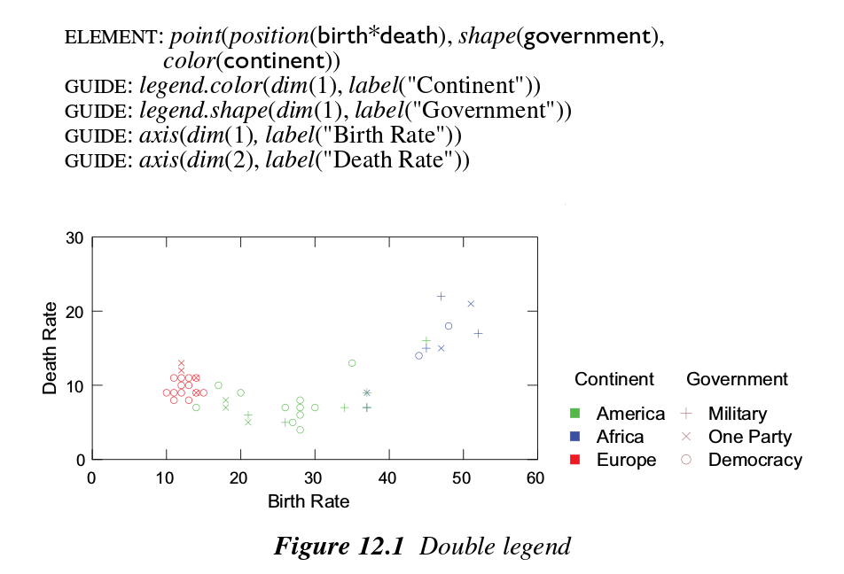
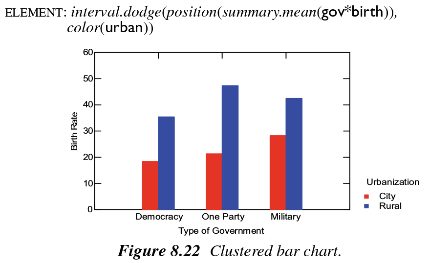
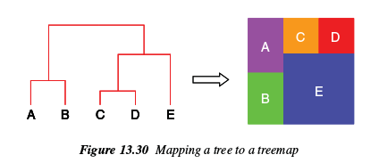
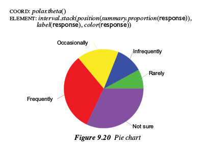
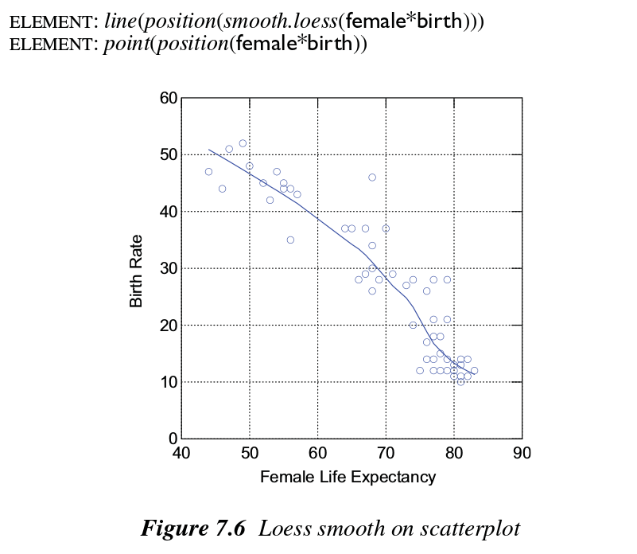
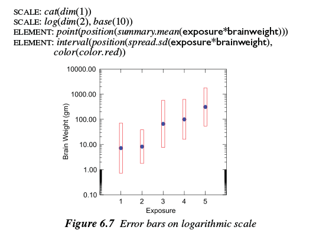

The Grammar of Graphics
======

In order to produce complex graphics, it is helpful to conceive of
some primative components of graphics that can be added together.
The grammar of graphics provides these concepts.

In this lecture, we'll talk through the main concepts in the grammar
of graphics and show how they are used in graphics. Towards the end,
we'll use this grammar to deconstruct some famous graphics.

Most sections of these "slides" correspond to chapters in the
book *The Grammar of Graphics*. We're presenting them out of order
because I think this order is better. We'll talk through the
different concepts. For the more complicated ones, we'll draw
examples on the board.

<!--
If you don't want to draw examples on the board, you can just
prepare a bunch of plots in advance.
-->

## Command types

> Statistical graphic specifications are expressed in six statements:
> 
> 1. `DATA`: a set of data operations that create variables from datasets,
> 2. `TRANS`: variable transformations (*e.g., rank*),
> 3. `SCALE`: scale transformations (*e.g., log*),
> 4. `COORD`: a coordinate system (*e.g., polar*),
> 5. `ELEMENT`: graphs (*e.g., points*) and their aesthetic attributes (*e.g., color*),
> 6. `GUIDE`: one or more guides (*axes, legends, etc.*).

(page 7 of *The Grammar of Graphics*)

## Aesthetics
(chapter 10)

* Form (position, size)
* Surface (color, texture)
* Motion (direction, speed)
* Sound (tone, volume)
* Text

(There could be others, like sound.)

<!--
Draw variations of these aethetics
on the whiteboard.
-->

## Guides
(chapter 12)

Guides relate graphical information to
non-graphical annotations

* Scales (axis, legend)
* Annotations (text, image)

(page 350 of *The Grammar of Graphics*)

Note: `*` is called "cross". Think of it as
a factorial.

## Variables
(chapter 4)

Transforms

* Mathematical
* Statistical
* Multivariate

(page 48 of *The Grammar of Graphics*)

## Geometry
(chapter 8)

Geometric graphs

* Functions (point, line, area, &c.)
* Partitions (polygon, contour)
* Networks (edge)

Collision modifiers

* Stack (symmetric, asymmetric)
* Dodge (symmetric, asymmetric)
* Jitter (uniform, normal)

(page 174 of *The Grammar of Graphics*)

## Spaces
(chapter 13)

The underlying space versus the display space

(page 400 of *The Grammar of Graphics*)

## Coordinates
(chapter 9)

Transformations

* Isometry (translation, rotation, reflection)
* Similarity (dilation)
* Affine (stretch, shear)
* Projective
* Conformal

Specific things

* Polar coordinates (conformal)
* Warpings (conformal)
* Map projections (projective)

(page 208 of *The Grammar of Graphics*)

## Statistics
(chapter 7)

Methods

* Bin
* Summary
* Region
* Smooth
* Link

(page 126 of *The Grammar of Graphics*)

## Scales
(chapter 6)

* Scale transformations (`TRANS`)
* Really nice numbers: Nice sequences that
    include zero

(page 102 of *The Grammar of Graphics*)

## Examples

* Bar graph versus Pie chart
* Histogram
* Faceting
* Napoleon's march
* http://ggplot2.org/resources/2007-past-present-future.pdf
