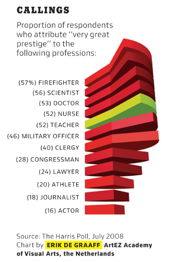
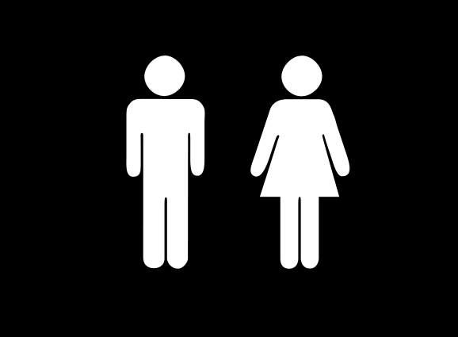
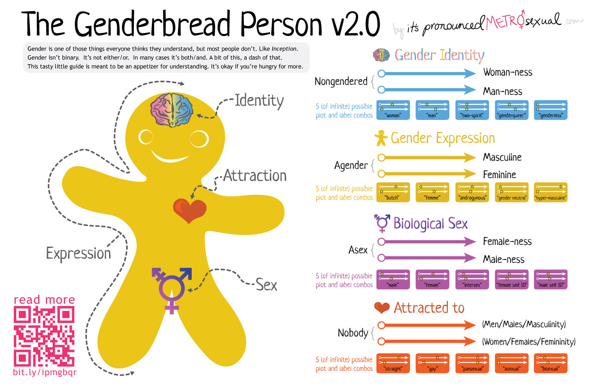

## 1. A good data visual
This interactive site:[Salary of Every BART Employee](http://blog.vctr.me/bart/ "BART Salaries") is a clean and clear representation of salary data. You can easily see how salaries are distributed by union - particularly on the "Base pay" attribute. In addition, each individual node has specific metadata which allows you to dig into specific job titles and salaries. Overall SEIU appears to have larger base salaries than those operators in ATU, with the exception of management. This highest salaries are non-union. However, when looking at "overtime to base pay", you can see that ATU workers have a much higher percentage - perhaps because of the type of jobs represented in that category (train operators). I really like this representation because it is beautiful and allows you to dig into the data in an enjoyable and intuitive way.

## 2. A bad data visual
Here is an example where the added dimensionality actually takes away some of the understanding. Am I supposed to imagine the volume of each pie piece as an element of comparison? Not taking the shading into effect, it looks like there is very little difference between "Clergy (40)" and "Firefighter (57%)". In addition ,the color shadings seem to be off and "Teacher" is highlighted green for some unexplicable reason. Also, only labeling the first element in an actual percentage seems inconsistent.

## 3. A good non-data visual
Perhaps this is outdated, but it makes it easy to see which door to choos.e

## 4. A bad non-data visual
I think this graphic is successful in showing that Gender is a confusing
classification. I think the intention is that Gender has these four facets:
Identity, Attraction, Expression and Sex and that each person has a different
quantification of how these facets are realized in qualities such as "woman"/
"man"/"butch"/"femme" etc. However, besides each slider is a label "5 (of infinite) possible plot and label combos." This doesn't make sense. One could conceivably define "butch"/"femme"/"androbynous"/"gender neutral"/"hyper-masculine" with the same measurement of "masculine"/"feminine". In which case, why have these descriptive attributes at all? 

Overall it seems like this is an advocacy piece to engage people to not think in binary terms. However, all the sliders and arrows make the Gender question just seem a bit arbitrary and difficult to understand. Perhaps this is the point?

