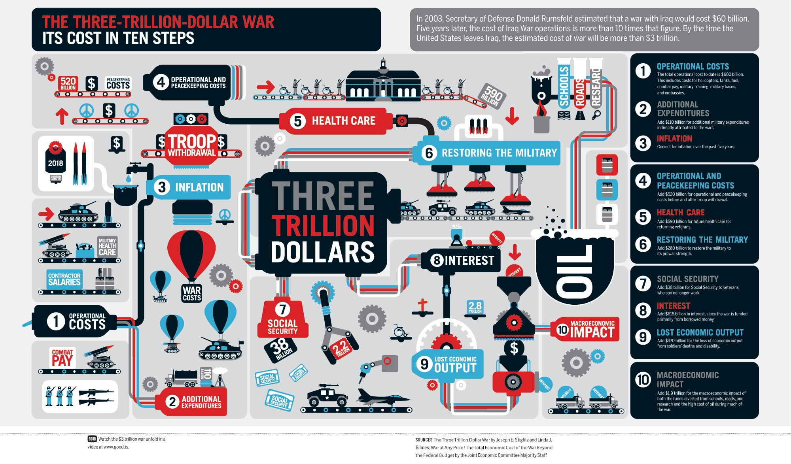

Visual critiques
================

## A bad data visual

### People could have multiple choice it doesnt' make any sense the sum is not 100%
### And It's FOX.

## A good non-data visual

### Beautiful way to represent time / space / in a creatve and meaningful way

## A bad non-data visual

### You cna't get what is the message .. too cahotic different paradigm used..

## A good data visual

### Compact way of presenting multiple infromation. 
### Meaningful way of aggregation
### At th3 same time have rerese axes can be confusing..

## Of course my graph ong Gov accounts is awesome :-)

